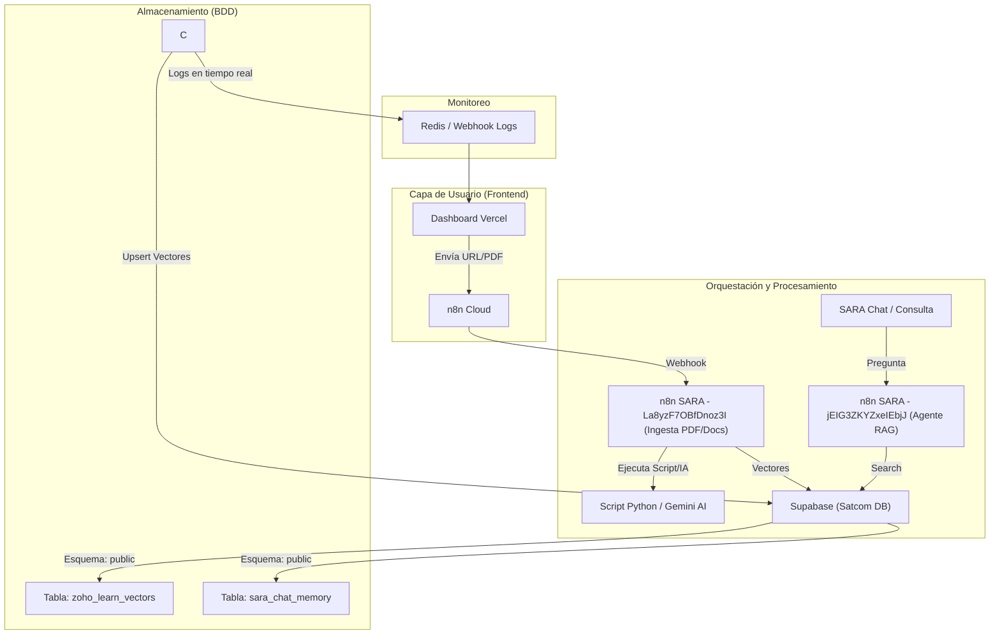

# 📘 Manual Técnico: Proceso de Ingesta y Consulta RAG - SATCOM

Este documento detalla el funcionamiento técnico del sistema de **Generación Aumentada por Recuperación (RAG)** de Satcom, utilizado para alimentar el conocimiento de **SARA** y gestionar la base de conocimientos desde el Dashboard.

---

## 🏗️ 1. Arquitectura General

El sistema RAG de Satcom opera como una orquestación distribuida entre un Dashboard de usuario, motores de flujo de trabajo n8n y una base de datos vectorial en Supabase.



---

## 🔄 2. Procesos de Ingesta (Carga)

El Dashboard permite dos vías de entrada de información: **Zoho Learn** (vía URL) y **PDF** (vía archivo).

### Flujo de Trabajo
1.  **Activación:** El usuario ingresa un link de Zoho Learn o sube un PDF en la pantalla de "RAG Knowledge Base".
2.  **Orquestación (n8n):** 
    - **Flujo de Entrada (Dashboard):** `https://satcomla.app.n8n.cloud/workflow/fb2jO5oU9BrCs66F`
    - **Procesador de PDFs y Documentación:** `https://sara.mysatcomla.com/workflow/La8yzF7OBfDnoz3I`
3.  **Procesamiento de Contenido:**
    - **Parsing:** El flujo extrae el texto y detecta elementos multimedia (imágenes).
    - **Chunking (Fragmentación):** Se divide el texto en bloques lógicos (chunks) para optimizar la relevancia de búsqueda.
4.  **Generación de Embeddings:**
    - Se utiliza el modelo **Gemini (Google)** para transformar cada fragmento de texto en un vector numérico.
5.  **Persistencia:** Los vectores y sus metadatos (título, URL, responsable) se guardan en la tabla `public.zoho_learn_vectors`.

### Scripts de Procesamiento Local (Python)

Para el manejo avanzado de documentos complejos (específicamente la ingesta de PDFs de "RAG 2° Generación"), el flujo de n8n delega el trabajo pesado a scripts de Python locales.

*   **Ubicación (Dónde residen):** Los scripts se ejecutan en el servidor auto-hosteado de SARA y se encuentran en el directorio `/opt/RAG/implementacion_SARA/`. El script principal es `sara_pdf_ingest_v3.py`.
*   **Función (Qué hacen):** Es invocado dinámicamente por n8n (vía nodo *Execute Command*) cuando el usuario sube un PDF. Sus responsabilidades incluyen:
    *   Leer el archivo temporal guardado en `/opt/RAG/temp_pdfs/`.
    *   Ejecutar la extracción profunda de texto (parsing) y fragmentación semántica (chunking).
    *   Enviar actualizaciones de estado en tiempo real al Dashboard llamando intermitentemente al webhook de logs (`https://sara.mysatcomla.com/webhook/logs`).
    *   Estructurar e inyectar metadatos vitales (Usuario, Origen/País, URL de referencia).
*   **Tecnología y Ejecución:** 
    *   **Entorno:** `Python 3` utilizando librerías nativas de procesamiento de datos y PDFs.
    *   **Ejemplo de Invocación desde n8n:**
        ```bash
        cd /opt/RAG/implementacion_SARA/ && python3 sara_pdf_ingest_v3.py \
        --pdf "/opt/RAG/temp_pdfs/FICHA_TECNICA.pdf" \
        --url "https://drive.google.com/..." \
        --webhook "https://sara.mysatcomla.com/webhook/logs" \
        --user "correo@satcomla.com" \
        --source "Ecuador"
        ```

---

## 🔍 3. Proceso de Consulta (RAG Chat)

Cuando un usuario interactúa con **SARA Chat**, el sistema realiza los siguientes pasos:

1.  **Vectorización de Pregunta:** La pregunta del usuario se convierte en un vector usando el mismo modelo de Gemini.
2.  **Búsqueda de Similitud (Vector Search):** Se ejecuta una función RPC en Supabase para encontrar los fragmentos más parecidos en `zoho_learn_vectors`.
3.  **Inyección de Contexto:** Los fragmentos encontrados se pasan a Gemini como "Contexto".
4.  **Gestión de Memoria:** SARA consulta la tabla `sara_chat_memory` para mantener el hilo de la conversación anterior.
5.  **Respuesta Generada:** Gemini responde basándose en la información recuperada y la memoria de chat.

---

## 🤖 4. Stack Tecnológico y Dependencias

El sistema RAG se apoya en un conjunto robusto de tecnologías modernas que interactúan para proporcionar una experiencia en tiempo real, precisa y escalable. A continuación se detalla el rol de cada componente dentro de la arquitectura.

### Orquestación y Lógica de Negocio
*   **n8n (Node-based Automation):** Actúa como el cerebro integrador del sistema. Se utiliza tanto en su versión **Cloud** (para recibir peticiones webhooks iniciales y actuar de puente) como en su versión **Auto-hosteada (SARA)** para el procesamiento intensivo y la interacción segura con la base de datos local. n8n maneja el parseo de documentos, el chunking de texto y la coordinación de todas las APIs.

### Base de Datos y Almacenamiento Vectorial
*   **Supabase (PostgreSQL):** Plataforma backend Open Source que sirve como repositorio principal de datos transaccionales y de configuración (memoria de chat, métricas de uso).
*   **pgvector:** Extensión de PostgreSQL (habilitada dentro de Supabase) estrictamente necesaria para el ecosistema RAG. Permite almacenar los embeddings de alta dimensión y ejecutar búsquedas matemáticas por "similitud de coseno" (`<=>`), haciendo posible la búsqueda semántica rápida de los fragmentos de texto más relevantes.

### Modelos de Inteligencia Artificial (Google)
*   **Modelo de Embeddings (`text-embedding-004`):** Este modelo especializado convierte fragmentos de texto (chunks) en vectores numéricos matemáticos de 768 dimensiones. Es fundamental en la fase de "Ingesta" y "Recuperación" para mapear semánticamente el significado del texto.
*   **Modelos Generativos (`gemini-1.5-flash` / `gemini-1.5-pro`):** Encargados de la fase final del RAG. Una vez que se recupera la información de Supabase, el modelo lee este contexto junto con la pregunta del usuario para redactar una respuesta coherente. `Flash` se utiliza para respuestas de alta velocidad, mientras que `Pro` se emplea en razonamientos o análisis profundos.

### Interfaz, Estado y Monitoreo en Tiempo Real
*   **Redis:** Base de datos clave-valor en memoria utilizada para la gestión de estados temporales y, primordialmente, para transmitir logs asíncronos en tiempo real hacia el Dashboard (ej. mostrando alertas de "Ingestando PDF" o "Generando Vectores").
*   **Vercel / Frontend:** El entorno de hosting serverless que aloja la interfaz gráfica del usuario (Dashboard de Satcom). Desde aquí, los usuarios pueden ingresar las URLs de Zoho Learn, subir PDFs y conversar directamente con el agente SARA.

---

## 🗄️ 5. Base de Datos y Estructura Vectorial

La base de datos reside en el proyecto Supabase `wpzfbpvtxrfyejoqjecu`. A diferencia de otros sistemas, Satcom utiliza el esquema **`public`** para una integración directa con los servicios de n8n.

### Arquitectura de Tablas y Dependencias
El sistema no solo depende de los vectores, sino de un ecosistema de tablas que gestionan el uso, el costo y la experiencia del usuario.

| Tabla | Función Principal | Dependencia |
| :--- | :--- | :--- |
| **`zoho_learn_vectors`** | **Base de Conocimiento:** Almacena los embeddings de Zoho y PDFs. | RAG Engine (n8n SARA). |
| **`sara_chat_memory`** | **Contexto de Conversación:** Memoria a largo/corto plazo para el agente SARA. | Chat Agent (n8n SARA). |
| **`ai_usage` / `ai_pricing`** | **Control de Costos:** Rastreo de tokens y precios por modelo. | Todos los flujos de IA. |
| **`chat_sessions` / `messages`**| **Frontend UI:** Persistencia de los mensajes mostrados en el dashboard. | Dashboard Vercel. |
| **`bot_users`** | **Identidad:** Usuarios autorizados para interactuar con SARA. | Auth System. |
| **`gemini_usage`** | **Métrica Específica:** Monitoreo del uso de la API de Google Gemini. | Google Cloud API. |

### Tablas de Respaldo (Estrategia de Seguridad)
Se observan tablas como `zoho_learn_vectors_backup_20260421`, lo cual indica un proceso de **Snapshotting** antes de realizar ingestas masivas. Esto permite revertir cambios si una ingesta de documentos (como PDFs corruptos) afecta la calidad del RAG.

### Función de Búsqueda (SQL)
Para realizar las consultas, se utiliza una función de Postgres para búsqueda por distancia de coseno (operador `<=>`):

```sql
/**
 * Función para búsqueda semántica en la base de conocimiento
 * Tabla: public.zoho_learn_vectors
 */
create or replace function match_zoho_learn (
  query_embedding vector(768), -- Dimensiones del modelo Gemini
  match_threshold float,
  match_count int
)
returns table (
  id uuid,
  content text,
  metadata jsonb,
  similarity float
)
language plpgsql
as $$
begin
  return query
  select
    v.id,
    v.content,
    v.metadata,
    1 - (v.embedding <=> query_embedding) as similarity
  from public.zoho_learn_vectors v
  where 1 - (v.embedding <=> query_embedding) > match_threshold
  order by v.embedding <=> query_embedding
  limit match_count;
end;
$$;
```

### Scripts de Ingesta y Gestión (SQL)

A continuación se detallan los scripts fundamentales utilizados para la inicialización, respaldo y mantenimiento de la base de conocimiento vectorial en Supabase. Estos scripts son esenciales para garantizar la integridad y calidad de los datos consumidos por SARA.

#### 1. Definición de la Tabla de Vectores (DDL)

**Propósito:** Crear la estructura de la base de datos necesaria para almacenar los embeddings generados por Gemini y los fragmentos de texto correspondientes. Actúa como el repositorio central del conocimiento del sistema RAG.

**Cuándo ejecutarlo:** Únicamente durante la configuración inicial del entorno (SATCOM o TINKAY) o si la tabla necesita ser recreada desde cero tras una migración.

**Consideraciones Técnicas:**
- **Extensión `vector`**: Obligatoria para soportar tipos de datos vectoriales en PostgreSQL (`pgvector`).
- **Dimensión del Vector**: Configurado a `768`, que es el tamaño de salida estándar del modelo `text-embedding-004` de Gemini.
- **Índice `ivfflat`**: Se añade para optimizar el rendimiento de las búsquedas por similitud de coseno (`vector_cosine_ops`), lo cual acelera las respuestas de SARA a medida que la base de datos crece.

```sql
-- Habilitar la extensión de vectores si no existe
CREATE EXTENSION IF NOT EXISTS vector;

-- Tabla principal de conocimiento RAG
CREATE TABLE IF NOT EXISTS public.zoho_learn_vectors (
  id UUID PRIMARY KEY DEFAULT gen_random_uuid(),
  content TEXT NOT NULL,          -- El fragmento de texto (chunk)
  metadata JSONB DEFAULT '{}',    -- Metadatos (url, título, responsable, etc.)
  embedding VECTOR(768),          -- Vector generado por Gemini
  created_at TIMESTAMPTZ DEFAULT now()
);

-- Índice para optimizar búsquedas vectoriales
CREATE INDEX ON public.zoho_learn_vectors USING ivfflat (embedding vector_cosine_ops)
WITH (lists = 100);
```

#### 2. Script de Respaldo (Snapshot)

**Propósito:** Crear una copia exacta (snapshot) de los datos actuales de la base de conocimiento antes de ejecutar modificaciones destructivas o ingresos masivos. Permite revertir cambios si una ingesta introduce datos corruptos o de baja calidad.

**Cuándo ejecutarlo:** 
- Antes de procesar múltiples PDFs o actualizar masivamente manuales en Zoho Learn.
- Como parte de la rutina de mantenimiento mensual.

**Consideraciones Técnicas:**
- Se recomienda usar una nomenclatura clara que incluya la fecha (ej. `YYYYMMDD`).
- **Restauración:** En caso de fallo, la restauración se hace eliminando la tabla actual y renombrando la de backup: `ALTER TABLE public.zoho_learn_vectors_backup_20260421 RENAME TO zoho_learn_vectors;`

```sql
-- Crear un snapshot con la fecha actual
CREATE TABLE public.zoho_learn_vectors_backup_20260421 AS 
SELECT * FROM public.zoho_learn_vectors;

-- Nota: Reemplazar la fecha (20260421) según el día de ejecución.
```

#### 3. Limpieza de Conocimiento (Purge)

**Propósito:** Eliminar fragmentos de conocimiento específicos para evitar la duplicación de contenido cuando un documento de Zoho Learn o un PDF es actualizado y re-ingresado al sistema. 

**Cuándo ejecutarlo:** 
- Inmediatamente antes de volver a ingresar un artículo que fue modificado en Zoho Learn.
- Cuando se detecta que información obsoleta de un manual específico está causando alucinaciones en las respuestas de SARA.

**Consideraciones Técnicas:**
- **Filtrado por Metadatos:** Utiliza el campo `JSONB` (`metadata`) para aislar los vectores que pertenecen exclusivamente a una URL específica. 
- **Precaución:** Se incluye el comando `TRUNCATE` comentado para casos extremos donde se requiere limpiar todo el conocimiento (ej. reseteo total de SARA). Usar con máxima cautela.

```sql
-- Borrar registros de una fuente específica antes de re-ingresar
DELETE FROM public.zoho_learn_vectors 
WHERE metadata->>'source_url' LIKE '%link_del_articulo%';

-- Limpiar todos los registros (USAR CON PRECAUCIÓN)
-- TRUNCATE TABLE public.zoho_learn_vectors;
```

---

## 🌐 6. Dominios y Conectividad

-   **Dashboard:** `https://dashboard-one-ivory-58.vercel.app` (Vercel)
-   **n8n Cloud:** `https://satcomla.app.n8n.cloud/`
-   **n8n SARA (Auto-hosteado):** `https://sara.mysatcomla.com`
-   **Sitio de Recursos:** `https://learn.zohopublic.com/...` (Fuente de datos)

---

## 📋 7. Resumen de Flujos y Dependencias

- **Flujo de Ingesta Principal (Cloud):** `fb2jO5oU9BrCs66F` -> Recibe peticiones del Dashboard.
- **Flujo de Procesamiento PDF/Docs (SARA):** `La8yzF7OBfDnoz3I` -> Procesa archivos, fragmenta texto y actualiza Supabase.
- **Flujo de Agente de Consulta (SARA):** `jEIG3ZKYZxeIEbjJ` -> Realiza la búsqueda semántica y genera respuestas.
- **Dependencia Crítica:** Conexión activa a Redis para el visor de logs en tiempo real (`SARA Knowledge Agent`).

---
*Manual generado por Antigravity - Proyecto SATCOM*
