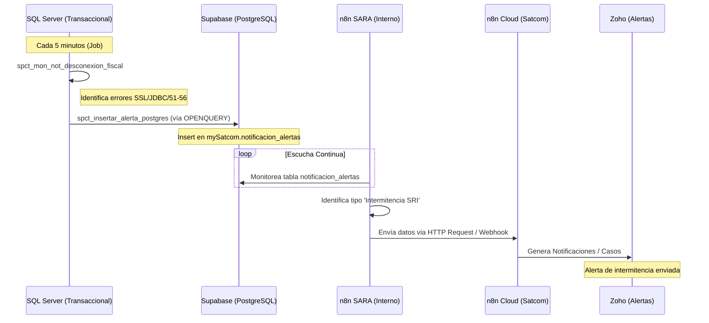

# Proceso: Monitoreo de Intermitencias SRI (Conexión Fiscal)

Este documento describe el flujo completo de detección, procesamiento y notificación de intermitencias en la conexión fiscal (SRI), abarcando desde la base de datos transaccional hasta las alertas en Zoho.

## 1. Ficha Técnica de Flujos n8n
| Componente | URL de Acceso | Rol en el Proceso |
| :--- | :--- | :--- |
| **n8n SARA (Interno)** | [Llamado SRI SARA](https://sara.mysatcomla.com/workflow/2Y0UEWqTBmUStBjE) | Procesamiento y filtrado de eventos en PostgreSQL. |
| **n8n Cloud (Varios)** | [Notificaciones Zoho](https://satcomla.app.n8n.cloud/workflow/94mF5FQ92rYh2h0w) | Orquestación de salida y alertas en Zoho. |

## 2. Diagrama de Arquitectura (Mermaid)

## 3. Componentes Técnicos Detallados

### 3.1. Origen: SQL Server
El proceso nace de un Stored Procedure que analiza la bitácora de comprobantes XML.
*   **Procedimiento:** `spct_mon_not_desconexion_fiscal`
*   **Lógica de Filtro:** 
    *   Estados: `51, 53, 55, 56`.
    *   Errores detectados: `The SSL`, `SSL/TLS`, `sending`, `GenericJDBCException`.
*   **Acción:** Agrupa por país y hora, construye un mensaje detallado y llama al SP de envío.

### 3.2. El Puente: PostgreSQL (Supabase)
Se utiliza un SP intermedio, `spct_insertar_alerta_postgres`, que actúa como bridge hacia la nube.
*   **Tecnología:** `OPENQUERY` desde SQL Server hacia Linked Server `POSTGRES_ALERTS`.
*   **Tabla Destino:** `mySatcom.notificacion_alertas` (en Supabase Project `wpzfbpvtxrfyejoqjecu`).
*   **Campos clave:** `severity`, `process`, `country`, `message`, `extra_info` (formato JSON).

### 3.3. Procesamiento Interno: n8n SARA
El flujo en SARA (ID: `2Y0UEWqTBmUStBjE`) se encarga de la vigilancia de la base de datos PostgreSQL.
*   **Función:** Leer los nuevos registros en `notificacion_alertas`, filtrar los específicos de intermitencia SRI y disparar la alerta hacia la instancia Cloud.

### 3.4. Notificación Final: n8n Cloud + Zoho
El flujo en la nube de Satcom (ID: `94mF5FQ92rYh2h0w`) recibe el paquete de información depurado.
*   **Acción:** Realiza la integración con la API de **Zoho** para alertar al equipo soporte/helpdesk sobre la intermitencia fiscal detectada.

## 4. Dependencias y Recursos
- **BDD SQL:** Sat_comprobante / Sat_catalogo.
- **Linked Server:** `POSTGRES_ALERTS` configurado en el OCI-WWW5.
- **Supabase ID:** `wpzfbpvtxrfyejoqjecu`.
- **Credenciales Zoho:** Gestionadas en la instancia Cloud de n8n.
