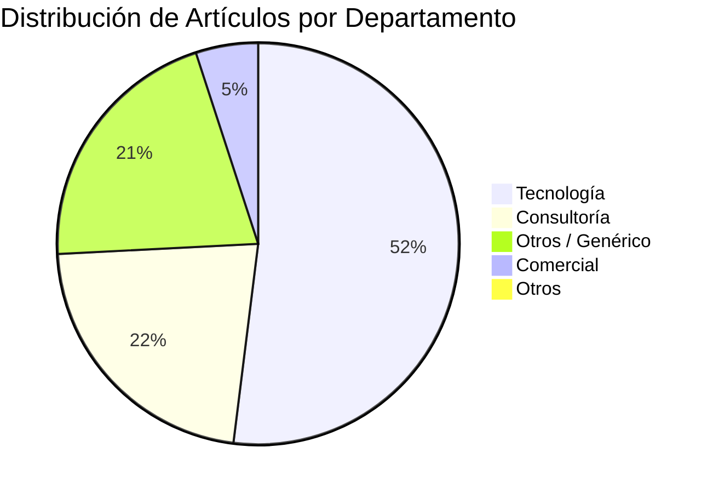
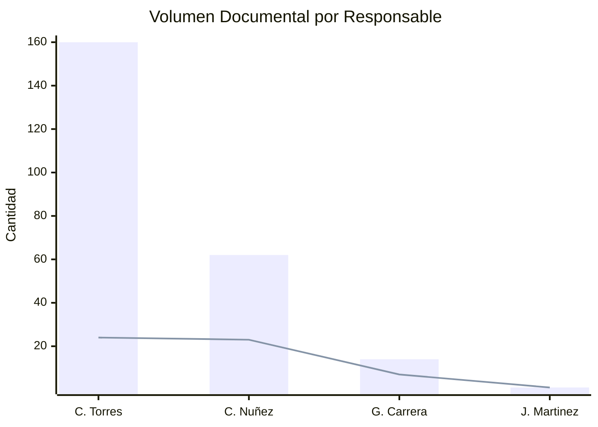
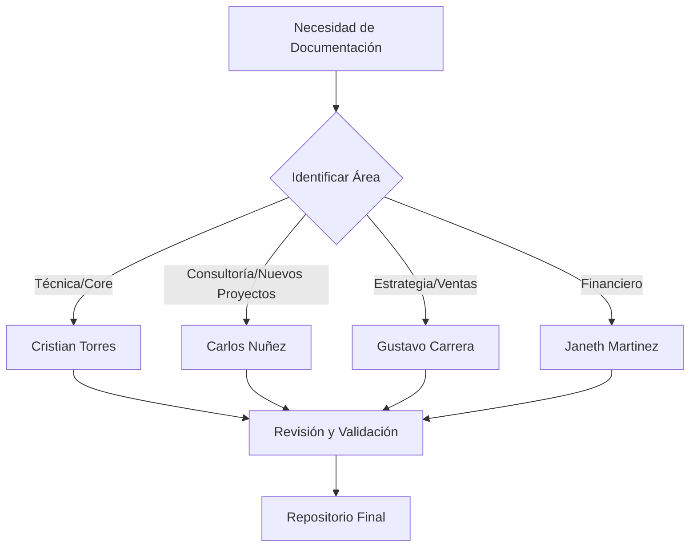

# Manual de Responsables de Documentación - Satcom

Este documento detalla la estructura de responsabilidades para la creación y mantenimiento de la documentación técnica, operativa y comercial dentro de la organización, basado en el inventario de artículos actual.

## 1. Distribución por Departamento
La documentación se organiza principalmente en torno a cuatro ejes fundamentales: Tecnología, Consultoría, Comercial y Otros/Genérico.

## 2. Responsables: Manuales vs Artículos
A continuación se presenta un comparativo entre la cantidad de temas (Manuales) y el volumen total de entradas (Artículos) bajo la gestión de cada responsable.

> [!NOTE]
> Las barras representan los **Artículos** totales, mientras que la línea indica la cantidad de **Manuales/Temas** distintos gestionados.

### 📋 Matriz de Responsabilidades Detallada
| Responsable | Manuales Únicos | Total Artículos | Departamento Dominante |
| :--- | :---: | :---: | :--- |
| **Cristian Torres** | 24 | ~160 | Tecnología / Otros |
| **Carlos Nuñez** | 23 | ~62 | Consultoría |
| **Gustavo Carrera** | 7 | ~14 | Comercial |
| **Janeth Martinez** | 1 | 1 | Financiero |

---

## 3. Estructura de Manuales Relevantes

### 🛠️ Tecnología (Liderado por Cristian Torres)
*   **APIs e Integraciones:** Documentación técnica de `api-integraciones`, `api-ofis-flip` y `bridge`.
*   **Soporte de Aplicaciones:** Informes semanales de rendimiento y resolución de incidencias técnicas.
*   **Sistemas Core:** Manuales de usuario y técnicos de `Simphony`, `TCPOS` y toda la línea `MySatcom V5`.
*   **Infraestructura:** Guías de prerrequisitos (IIS, Redis, RabbitMQ, SQL Server).

### 🔍 Consultoría (Liderado por Carlos Nuñez)
*   **Implementaciones Especiales:** Manuales técnicos para clientes estratégicos como KFC, Roky's y Montero.
*   **Innovación y Automatización:** Guías sobre Ingesta de documentos, configuración de entornos RAG e integración con Zoho Learn.
*   **Versiones de Próxima Generación:** Liderazgo en la documentación de `MySatcom V6` y migraciones a Simphony.

### 📈 Comercial (Liderado por Gustavo Carrera)
*   **Inteligencia de Negocio:** Informes de cierre comercial y análisis de facturación mensual.
*   **Gestión de Clientes:** Procesos de categorización de clientes y protocolos de salida (Churn).

---

## 4. Flujo de Gestión Documental

> [!IMPORTANT]
> Se recomienda que cualquier cambio estructural en los manuales de **Tecnología** sea notificado a Cristian Torres para asegurar la consistencia con las versiones activas (`V5` y `V6`).

> [!TIP]
> Para consultas sobre nuevas tecnologías de **IA y RAG**, el referente técnico directo para la documentación es Carlos Nuñez.
